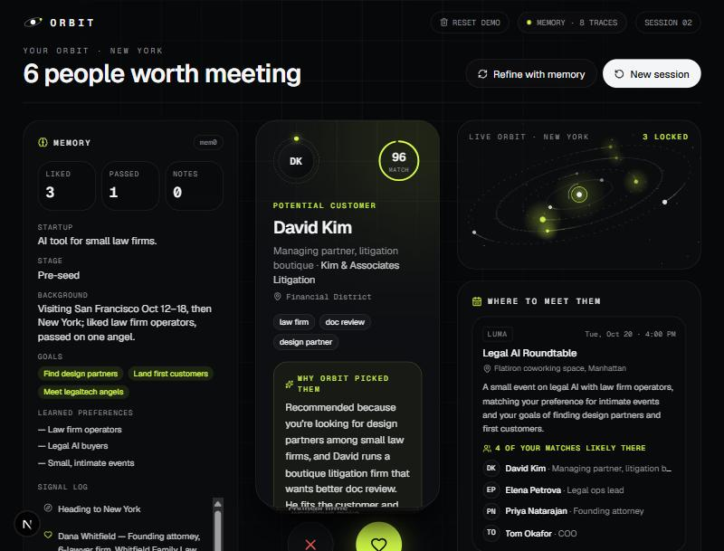

# Orbit

A memory-powered networking agent for startup founders. Tell Orbit where you're headed and what you're building, and it recommends the people and events worth your time in that city. Swipe right or left on people, and Orbit remembers. Next trip, it already knows who you are and who you actually want to meet.

Built for a buildathon around [mem0](https://mem0.ai) long-term memory.

## How it works

1. **Intake**: pick a city, describe your startup, choose goals.
2. **Recommend**: the backend recalls your memory from mem0, then asks Claude for 6 people and 3 events, each with a "why" tied to what it remembers.
3. **Swipe**: likes, passes and free-text feedback are written to mem0 in the background.
4. **Come back**: a new session greets you with your stored profile and ranks a new city using your past swipes.



See the [demo walkthrough](demo-walkthrough/README.md) for a screenshot tour, and [DEMO.md](DEMO.md) for the click-by-click demo script.

## Stack

| Piece | Choice |
|---|---|
| Frontend | Next.js, React, Tailwind, motion |
| Backend | Python, FastAPI (single file, `backend/main.py`) |
| Memory | mem0 hosted (`MemoryClient`) |
| LLM | Claude (`claude-sonnet-5-5`) via the `anthropic` SDK |

## Project layout

```
backend/
  main.py          API: recommend, swipe, feedback, memory
  seed.json        Known local people and events per city
  requirements.txt
frontend/
  app/             Next.js app router
  components/orbit/  Intake, swipe deck, memory panel, events panel
  next.config.mjs  Proxies /api/* to the backend
demo-walkthrough/  Screenshot tour of the demo flow
```

## Setup

You need Python 3.10+, Node.js, a [mem0 API key](https://app.mem0.ai) and an [Anthropic API key](https://console.anthropic.com).

**Backend**

```
cd backend
python -m venv .venv
.venv\Scripts\activate
pip install -r requirements.txt
```

Create `backend/.env`:

```
MEM0_API_KEY=your-mem0-key
ANTHROPIC_API_KEY=your-anthropic-key
```

```
uvicorn main:app --port 8000
```

Check it at http://127.0.0.1:8000/api/health. Live API docs are at http://127.0.0.1:8000/docs.

**Frontend**

```
cd frontend
npm install
npm run dev
```

Open http://localhost:3000. By default it proxies `/api/*` to `http://127.0.0.1:8000`; set `BACKEND_URL` to change that.

## API

| Method | Path | Purpose |
|---|---|---|
| GET | `/api/health` | Liveness check |
| GET | `/api/memory?user_id=` | Profile, cities visited, remembered facts |
| POST | `/api/recommend` | Build a deck of 6 people and 3 events for a city |
| POST | `/api/swipe` | Record a like or pass |
| POST | `/api/feedback` | Record free-text feedback |
| DELETE | `/api/memory?user_id=` | Wipe a user's memory (demo helper) |

## Notes

- Each browser gets a user ID in `localStorage` (`orbit-user-id`). Use **Reset demo** in the header, or an incognito window, to start as a new founder.
- Profile and visited cities are kept in `backend/state.json`, which is git-ignored.
- People outside the seeded cities are invented personas, not real individuals.
