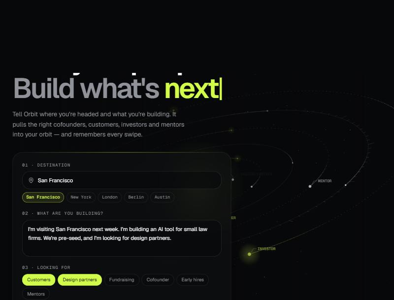
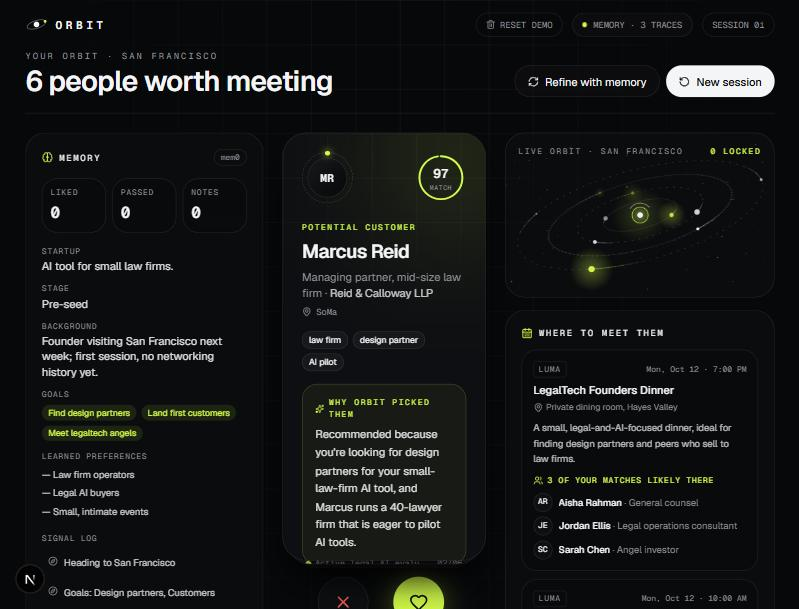
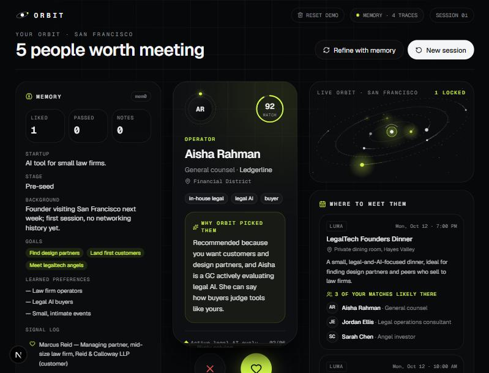
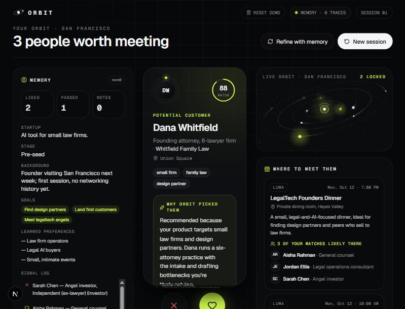
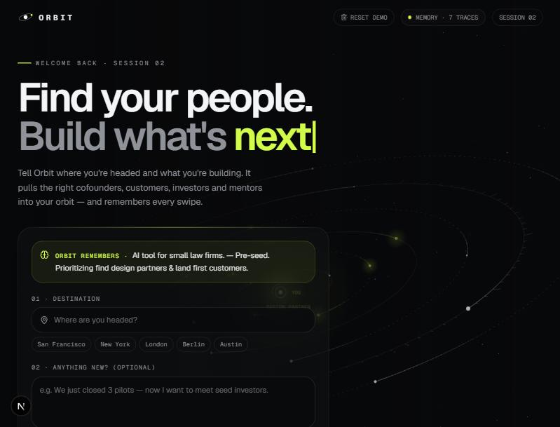
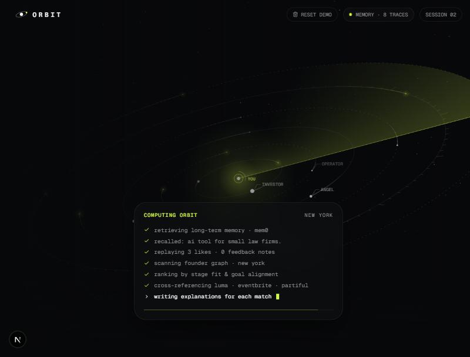

# Orbit: demo walkthrough

A founder plans a trip to San Francisco, swipes on people, then plans a trip to New York. Orbit remembers them in between, via mem0. Screens captured from the running app.

## 1. Intake: where are you going, what are you building?

The founder picks a city, describes the company and chooses goals. **Load demo founder** pre-fills San Francisco, an AI tool for small law firms, and the goals Design partners + Customers.

Frontend: `frontend/components/orbit/intake.tsx`

## 2. Session 1: six people and three events for San Francisco

**Launch orbit** calls `POST /api/recommend`. The backend stores the brief in mem0, asks Claude for 6 people and 3 events (seeded local people from `seed.json` plus invented personas), and returns a "why" for each card. The Memory panel on the left shows the extracted profile: startup, stage, goals and learned preferences.

Backend: `recommend()` in `backend/main.py`. Frontend: `swipe-deck.tsx`, `memory-panel.tsx`, `events-panel.tsx`.

## 3. Swipe right to connect, left to pass

Each swipe sends `POST /api/swipe`. The backend turns it into a sentence such as "User liked (swiped right on) Marcus Reid, a Managing partner…" and writes it to mem0 in a background task, so the UI never waits. The Liked counter and the signal log update right away.

## 4. Build up signal

Two likes (law-firm partner, general counsel) and one pass (an angel investor). The signal log on the left records each one. A feedback note ("Prefer small dinners over big mixers") goes through `POST /api/feedback` the same way.

## 5. Session 2: "Welcome back"

Click **New session**. The intake now says "Welcome back · session 02" and an "Orbit remembers" box shows the startup, stage and goals. The founder is not asked who they are again. This comes from `GET /api/memory`, so it survives a page reload.

Backend: `get_memory()` reads mem0 plus `state.json` (profile, cities, session count).

## 6. Orbit recalls memory before ranking

Choose New York and launch. The scanning screen shows the steps: retrieving long-term memory from mem0, recalling the profile, replaying 3 likes, then ranking by stage fit and goal alignment.

Backend: three `recall()` searches (profile, liked, skipped) go into the Claude prompt. Frontend: `scanning.tsx`.

## 7. The payoff: a New York deck shaped by San Francisco swipes

With no brief typed, the top card is David Kim, a litigation-boutique managing partner (96 match), and the events are small and legal-focused: the Legal AI Roundtable lists four likely attendees from the deck. The Memory panel now says "Visiting San Francisco Oct 12-18, then New York; liked law firm operators, passed on one angel."

## How it fits together

- **Frontend** (Next.js): `orbit-app.tsx` holds the flow, and `/api/*` is proxied to the backend in `next.config.mjs`.
- **Backend** (FastAPI): `/api/recommend`, `/api/swipe`, `/api/feedback`, `/api/memory` (GET and DELETE).
- **Memory**: mem0 stores facts per `user_id`; `state.json` keeps the profile and visited cities.
- **LLM**: Claude builds the deck as JSON from the memory facts, liked and skipped lists, and the seed data.

To run it yourself, see the [main README](../README.md) and the click-by-click script in [DEMO.md](../DEMO.md).
